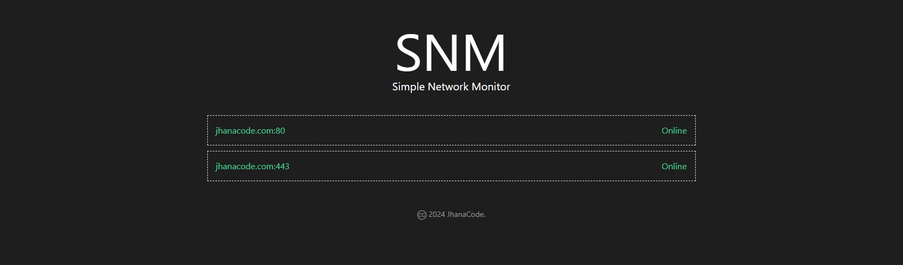

SNM
---

A simple network monitor. This application is extremely lightweight and secure, it does not log any data, or save anything to disk, there is no database connection or API integrations.

This is all I needed! However, you can fork and add any integrations and customize this application to your hearts content. For example, you can start logging to a db, or enable email and sms notifications.



### Packages

- `flask`: for the interface and routing.
- `notify-py`: for desktop/mobile notifications.

### Configuration

Simply edit the `app.py` file to add your domains/ip addresses and ports to the `hosts` list.

### Getting started

**Create a python virtual environment:**
```bash
python -m venv .venv
.venv/Scripts/activate # on Windows
. .venv/bin/activete # on Linux or Mac
```

**Install requirements:**
```bash
pip install -r requirements.pip
```

**Run dev server:**
```bash
flask run
```

### License

[MIT License](./license) - &copy; 2024 Jhanacode